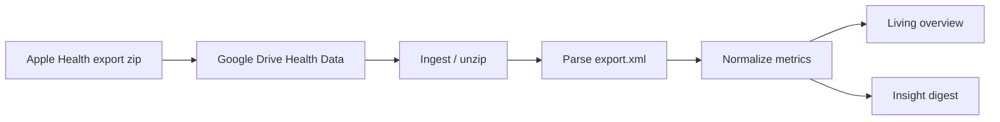

# Apple Health insights

Turn a manual Apple Health export zip into a private, Whoop-like overview and a short insight digest.

**Public code. Private data.** This repository is public on purpose. Real exports, `export.xml`, and living overviews stay in Google Drive (Health Data) and private box scratch — never in git, CI, or chat tool returns. Docs and tests use **synthetic** fixtures only.

## Status

Seed commit so the matching Cursor cloud environment can open pull requests. Scaffold + parse pipeline land next.

## Pipeline (target)

Drive drop folder is private; folder id is documented in Product SoT, not hard-coded as a secret.

## Privacy

- No secrets in this repo
- No raw health XML/CSV/zips with real data
- Aggregates and digests only in agent-facing surfaces

## License

Private use for the owner; treat committed files as world-readable.
