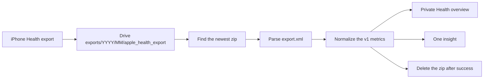
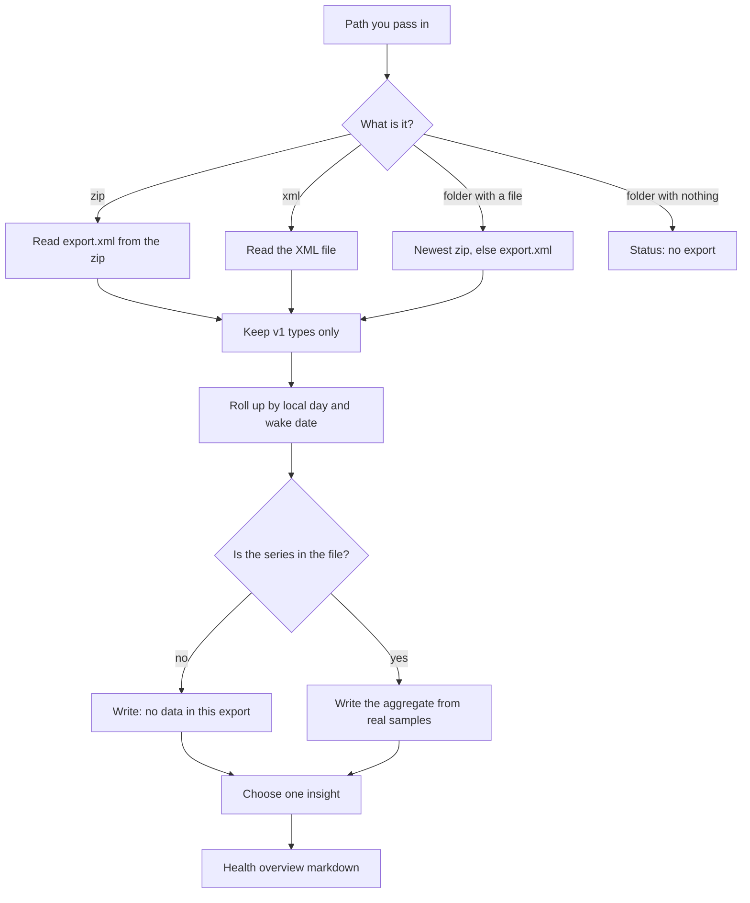
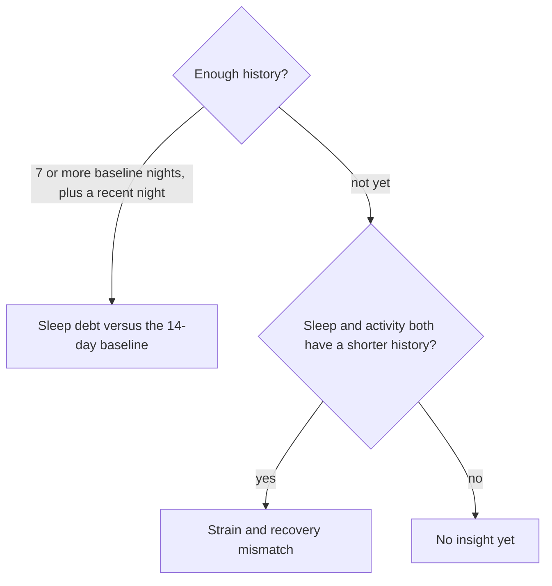

# Apple Health insights

A manual Apple Health export is a zip full of XML. This project turns that file into a short private overview: how sleep, activity, cardio, workouts, and body mass look in the export, plus one insight. The code is public. The export is not.

Nothing here connects to an iPhone. The ingest command does not call Google Drive. You export on the phone, put the zip in a private Drive folder, and run the ingest on a machine you control. An optional MCP plugin can list and download from that folder when a token is present; CI never does. The living overview stays in that private folder or in a local scratch directory.

This is an observational digest. It is not medical advice, a diagnosis, or a training plan.

## What you get

v1 reads a fixed set of Apple types and writes two private files:

- `Health overview.md`, a narrative of aggregates
- `normalized-store.json`, the same rollup as daily and nightly numbers

The overview always includes one insight. Sleep debt versus the prior 14 days comes first. That comparison needs at least seven nights in the baseline window. A gap of 30 minutes or more is stated as shorter or longer; a smaller gap is stated as close to the baseline. If the baseline is too thin, the run looks for a strain and recovery mismatch: recent steps or active energy at least 1.2 times the earlier baseline, together with recent sleep at least 45 minutes shorter than the earlier nights. When the history is there but the pattern is not, the overview says so. Later ideas, such as a standalone resting-heart-rate insight, workout streaks, and goal adherence, are not in this version.

A series that is absent from the export is written as **no data in this export**. A gap is never filled with zero.

## What this is not

- Not a live HealthKit sync
- Not a Drive client inside the ingest command. Drive list and download exist only in the MCP plugin, and only when a token is set
- Not a published Marketplace plugin. Packaging is parked and unpublished
- Not a place to commit exports, tokens, or a real overview
- Not a medical device

## How a week moves through the system

Once a week, export from the Health app on the iPhone and put the zip in the private Drive folder `1kmz1nYyZS7je75Ej_QH9r8m0880W62xo` (Health Data). Inside that folder the export lives at `exports/YYYY/MM/apple_health_export/`. The middle folder is the month, two digits. October 2026 is `exports/2026/10/`, which is where the live tree sits. That folder id is documentation of the drop zone. This repository does not store a Drive token. The ingest command cannot read the folder. The MCP plugin can, when a token is supplied at runtime.

Ingest runs locally and records a content hash so the same file is not written twice. After a successful ingest the zip is deleted from Drive. The living overview stays in Health Data or in private scratch. On a local disk this package also skips a `processed/` directory; Drive does not use that name.



Inside the package the path is the same whether the input is a zip, a loose `export.xml`, or a folder:



The empty folder is a normal result. The command exits 0, says that no export was found, and writes an overview that says so. It does not invent a night of sleep or a step count. If an overview is already in the output directory, an empty run leaves it alone.



## Metrics

Windows are calendar dates on each sample's own timestamp. The export date is "today" for the digest. Sleep is attached to the wake date, which is the local date when the interval ends. Steps, exercise, energy, resting heart rate, and HRV are attached to the local date when the sample starts.

| Section | Apple types | What the overview says |
|---|---|---|
| Recovery / sleep | Sleep analysis, asleep stages preferred over in-bed | Last night, 7-day average, and whether those nights were steady or variable |
| Strain / activity | Step count, exercise time, active energy. Activity summary fills a day only when that quantity is missing | Today and a 7-day average |
| Cardio | Resting heart rate, HRV SDNN when present | 7-day average against the 7 days before that. HRV is "no data" when the type is absent |
| Workouts | Workout elements | Count and top types for 7 days and 30 days |
| Body | Body mass, optional | Latest value, and the change across the prior 30 days when two points exist |

Displayed averages are rounded. Overlapping sleep intervals are merged, so a watch export and a phone export of the same night are not added together. High-frequency heart rate is ignored on purpose. It is not part of the digest.

"7-day" means the export date and the six days before it. The sleep baseline is the 14 dates before the latest three dates. Workout "30 days" means the export date and the 29 days before it. Body mass includes a point that falls on the day 30 days before the export.

## Run it

```bash
python -m pip install -e ".[dev]"
python -m apple_health_insights ingest fixtures/synthetic/export.zip --out state/health
```

`state/health/` is gitignored. Point `--out` somewhere private if you ever run a real export. A second run of the same file prints `already_ingested` and does not rewrite the overview. `--force` writes it again.

```bash
python -m apple_health_insights ingest /path/to/empty-folder --out state/health
python -m apple_health_insights ingest fixtures/synthetic/export.xml --out state/health --force
```

Exit `0` means ingested, already ingested, or a clean empty folder. Exit `2` means the path was missing, the zip had no `export.xml`, or the XML could not be parsed.

Try the synthetic zip before a real one. The fixture is labeled `SYNTHETIC`, the last three nights are short on purpose, and the overview should land on sleep debt. A heart-rate sample of 177 count/min and a summary energy of 999 kcal are in the file as decoys. They are not overview inputs.

## Privacy

Real Apple Health exports stay in the private Drive Health Data folder (`exports/YYYY/MM/apple_health_export/`) and in private scratch on the machine that runs ingest (`state/health/`, gitignored). CI does not download them. The MCP plugin downloads a zip only into that scratch directory when a token is present, and only long enough to ingest it. A real zip, its `export.xml`, and the overview produced from it never belong in git or in a pull request. The only export committed here is the synthetic fixture. After a successful ingest the Drive zip is deleted.

- The GitHub repo is public. Treat every committed file as world-readable.
- Do not commit a real zip, `export.xml`, CSV pull, living overview, or normalized store.
- Do not commit Drive tokens, file contents, or `.env` files.
- Docs and CI use the synthetic fixture only.
- The MCP plugin returns the digest, not the XML.

## MCP plugin

Cursor can load this repository as a plugin. The Marketplace listing is parked and unpublished. Do not publish it.

The server is stdio, four tools, nothing else:

```bash
python3 -m apple_health_insights.mcp_server
```

`python -m apple_health_insights.mcp_server` is the same module when `python` is Python 3.11 or newer. Root `mcp.json` launches `python3` with that module. The console script `apple-health-insights` and `python -m apple_health_insights ingest` stay the ingest entrypoints. The plugin shells out to the module; it does not reimplement parsing.

| Tool | Returns |
|---|---|
| `health_inbox_status` | id, modifiedTime, size, sanitized label. No file bodies |
| `health_ingest_latest` | status, counts, insight kind, path to the overview |
| `health_overview` | structured aggregates and the short overview markdown |
| `health_insights` | ranked insights, at most three (v1 is one) |

None of them return `export.xml`, zip bytes, Record attributes, GPS, or notes.

Drive is optional. Set `HEALTH_DRIVE_ACCESS_TOKEN` or `GOOGLE_ACCESS_TOKEN` to use folder `1kmz1nYyZS7je75Ej_QH9r8m0880W62xo`. Inside that folder the layout is `exports/YYYY/MM/apple_health_export/`. Without a token, pass `inbox_path` or a fixture `path`. CI uses `fixtures/synthetic/` only.

When a Drive download ingests successfully (the CLI exits 0), the server deletes that zip in Drive and removes the scratch copy under the private `--out` directory. The ingest package itself still does not call Drive. A failed ingest leaves the Drive zip in place.

`HEALTH_STATE_DIR` overrides the default `state/health` overview directory. `HEALTH_DRIVE_FOLDER_ID` overrides the Health Data folder id. `HEALTH_INBOX_PATH` is the local inbox used when no token is set.

The living overview stays private under the Health Data root or in local scratch. This repository does not fetch it and does not embed a Drive file id for it.

Soft-prove on a synthetic fixture:

```bash
python -m pip install -e ".[dev]"
python -m pytest
python3 -m apple_health_insights.mcp_server
```

The pytest suite calls `health_ingest_latest` on `fixtures/synthetic/export.zip`, then `health_overview` and `health_insights`. The payloads are aggregates. They do not contain the fixture XML.

## Development

```bash
python -m pytest
```

GitHub Actions runs that same suite on the synthetic fixture. There is no Drive download in CI.

## License

Private use for the owner. Treat committed files as world-readable.
